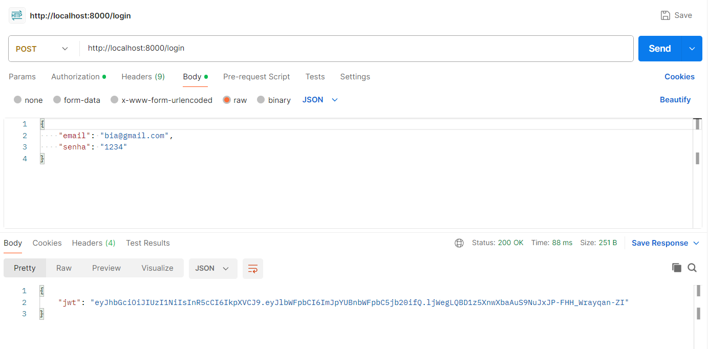

# Projeto de Cloud

## Nome: Beatriz Rodrigues de Freitas

### Projeto:

API desenvolvida utilizando FastAPI e conectada com o postgresql. Permite cadastro e login do usuário, e a consulta da temperatura máxima e mínima da cidade de São Paulo no dia. As informações da consulta foram obtidas através de um web scraping. A fonte foi a [página do G1](https://g1.globo.com/previsao-do-tempo/sp/sao-paulo.ghtml) de previsão de tempo da cidade de São Paulo e é atualizada diariamente.

Link para o vídeo com execução da aplicação: https://youtu.be/wgMiOmCpOk8

### Publicação no Dockerhub:

Para a publicação da imagem da API no dockerhub, foi criado um repositório (api-image). Após isso, foi executado o comando abaixo dentro da pasta app, onde está localizado o arquivo Dockerfile. O comando utilizado realiza a criação e publicação da imagem tanto para Windows quanto para Linux.

`docker buildx build --platform linux/arm64,linux/amd64 --push -t beatrizrodriguesf/api-image .`

Link da imagem no dockerhub: https://hub.docker.com/r/beatrizrodriguesf/api-image

### Execução da aplicação:

Para executar a aplicação basta clonar o repositório e executar o comando abaixo na raiz do repositório, onde está localizado o arquivo **compose.yaml**.

`docker compose up`

Como foi definido no compose.yaml, a conexão com a aplicação se dará pela porta 8000. Dessa forma, as requisições serão feitas partindo de localhost:8000.

### Endpoints da API:

- `/registrar` : Criação do usuário na base de dados

Método: POST  
Respostas HTTP: 201, 409  
`http://localhost:8000/registrar`

No body da requisição deverá ser passado um json com os campos name, email e senha. O usuário será criado caso o email ainda não esteja cadastrado no banco de dados. Se a requisição for bem sucedida retorna um token.

Requisição bem sucedida:

Erro quando o email já está cadastrado:

- `/login` : Fazer login do usuário

Método: POST  
Respostas HTTP: 200, 401  
`http://localhost:8000/login`

No body da requisição, deverá ser passado um json com email e senha. Caso a requisição seja bem sucedida, retorna um token. A requisição não será bem sucedida caso o email não esteja cadastrado ou a senha esteja incorreta.

Requisição bem sucedida:

Erro quando o email não está cadastrado:

Erro quando a senha está incorreta:

- /consultar : Consulta de informação

Método: GET  
Respostas HTTP: 200, 403  
`http://localhost:8000/consultar`

O token obtido no cadastro ou login deve ser passado no campo Authorization, selecionando o tipo Bearer Token. Caso a requisição seja bem sucedida retornará a informação da temperatura máxima e mínima de São Paulo no dia. A requisição não será bem sucedida caso o token seja inválido.

Requisição bem sucedida:

Erro quando o token é inválido:

